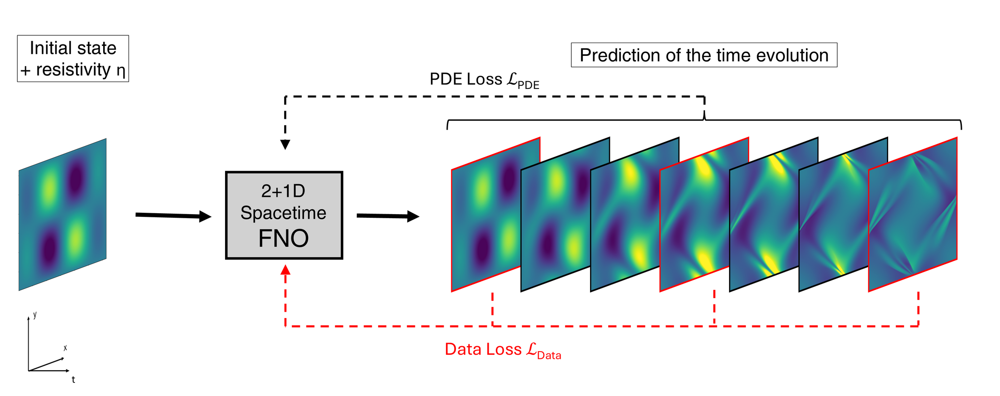

# Physics-Informed Neural Operators for Special-Relativistic Resistive MHD

A Fourier Neural Operator (FNO) surrogate for the **Black Hole Accretion Code
(BHAC)**, trained as a physics-informed neural operator (PINO) on the equations
of special-relativistic resistive MHD (SRRMHD). Given an initial state and the
resistivity η, the network predicts the full 2+1D spatiotemporal evolution of
the Orszag–Tang vortex — including plasmoid formation at low η, the regime
where data-only training fails.

This is the code accompanying my Master's thesis at the University of Würzburg
(Faculty of Physics and Astronomy, in cooperation with CAIDAS).

  

## Highlights

- **2+1D spacetime FNO** — predicts the full Orszag–Tang trajectory in a single
  forward pass, not autoregressively.
- **PDE loss at 8× finer temporal resolution than data** — the SRRMHD residual
  carries the model through every timestep without a labeled snapshot.
- **Recovers physics that data-only training cannot** — plasmoid formation at
  low η, the late-time ⟨B²⟩ peak, and fine structure in E_z, all measured on
  unseen resistivities at *unsupervised* timesteps.
- **Spectral (Fourier) derivatives** for the residual on a periodic domain,
  avoiding the memory cost of full Laplacian buffers.
- **Multi-phase weight schedule** — data-only warm-up, then a ramped PDE term
  with rate steps at epochs 500, 700, 1100.
- **Multi-GPU training** with NVIDIA PhysicsNeMo + DistributedDataParallel
  (3× L40).

## The idea

Reference SRRMHD trajectories from BHAC are stiff and expensive, so supervision
is enforced at only a sparse subset of timesteps. The governing SRRMHD
equations are evaluated as an additional residual loss at *every* intermediate
timestep — eight times finer than the data grid — giving the network an
incentive to behave physically between labeled snapshots.

The training objective is

  **ℒ = w_data · ℒ_data + w_PDE · ℒ_PDE + w_div · ℒ_∇·B**

where ℒ_data is enforced only at a strided subset of timesteps, ℒ_PDE is the
squared SRRMHD residual evaluated via Fourier derivatives at every timestep,
and ℒ_∇·B is a soft divergence-free constraint on B. The PDE weight is held
at zero during a data-only warm-up and then ramped through a multi-phase
schedule.

## Results

### Domain-averaged magnetic energy ⟨B²⟩

  

Without the PDE constraint (left), the FNO matches the labeled snapshots (red
dots) but oscillates between them and diverges at late times. With the PDE
residual loss (right), the same architecture and the same data supervision
track the full BHAC reference trajectory.

### Validation loss at unsupervised timesteps

  

Loss measured *only* at timesteps without data supervision. Without the PDE
loss (red), training stalls and then trends upward — the model overfits the
labeled frames. With the PDE loss switched on at epoch 100 (blue), the loss
keeps decreasing through epoch 2000.

### Plasmoid formation

At low resistivity, current sheets fragment into plasmoid chains through the
tearing instability. Trained on every 8th simulation snapshot, the data-only
FNO does not reliably predict plasmoids at intermediate timesteps. With the
PDE residual enforced at the finer temporal grid, plasmoid structure
re-emerges. Figures are reproduced in the paper.

## Data

Reference simulations are produced with **BHAC** on a 256² base grid with 5
levels of adaptive mesh refinement.

- **Training set** — 23 simulations spanning η ∈ [10⁻⁴, 10⁻³], covering the
  Sweet–Parker and fast reconnection regimes.
- **Validation set** — 6 unseen resistivities.
- All reported metrics are evaluated on validation samples at timesteps
  *without* data supervision.

## Repository layout

| Path | Purpose |
|---|---|
| `train_bhac.py` | Hydra-driven training entrypoint. |
| `config/mhd_bhac.yaml` | All hyperparameters. |
| `losses/loss_mhd_physicsnemo.py` | Combined data + PDE + ∇·B loss. |
| `losses/mhd_pde.py` | SRRMHD residual definitions via PhysicsNeMo Sym. |
| `losses/fourier_derivatives.py`, `losses/finite_diff.py` | Spectral and FD derivative kernels. |
| `dataloaders/` | BHAC HDF5 readers and the `(inputs, outputs)` builder. |
| `utils/plot_utils.py` | Matplotlib / plotly prediction plots. |
| `plot_index.py`, `plot_B2_onValidation*.py` | Figure scripts for validation analyses. |
| `eval/` | Standalone sanity checks (∇·B statistics, per-channel norms, PDE residual on raw BHAC data). |
| `scripts/` | SLURM launchers for training, the ramping schedule, and figure plotting. |

## Paper

**Learning Neural Operator Surrogates for the Black Hole Accretion Code**
Nägele, Bös, Tan, Fromm, Scholtes · 2026

Joint work with the Chair for Machine Learning for Complex Networks (CAIDAS,
Würzburg) and the Theoretical Astrophysics group, Würzburg. The results in
this repository form part of a joint CAIDAS × Astrophysics Würzburg research
proposal.

[arXiv:2604.25985](https://arxiv.org/abs/2604.25985)

## Acknowledgments

This codebase is derived from
[NVIDIA PhysicsNeMo](https://github.com/NVIDIA/physicsnemo) and retains the
upstream Apache 2.0 license. NVIDIA copyright notices are preserved in every
derivative file; see `NOTICE` for the full list.

Reference simulations were produced with [BHAC](https://bhac.science/), the
Black Hole Accretion Code.

## License

Apache License, Version 2.0 — see [`LICENSE`](LICENSE) for the full text and
[`NOTICE`](NOTICE) for attribution.

## Author

**Matthias Nägele** — Master's student in Physics at the University of
Würzburg, working at the intersection of machine learning and relativistic
astrophysics.

- University of Würzburg · Faculty of Physics and Astronomy
- In cooperation with CAIDAS (Center for Artificial Intelligence and Data Science)
- Contact: [matthias.naegele@proton.me](mailto:matthias.naegele@proton.me)
